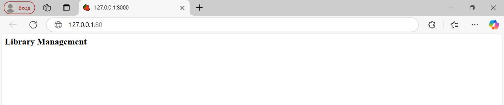
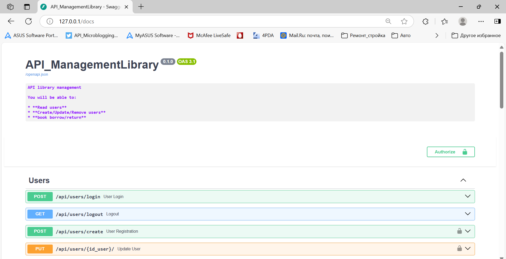
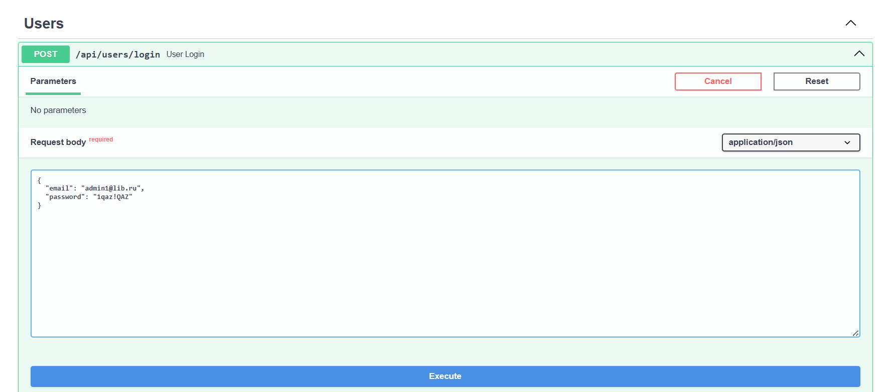
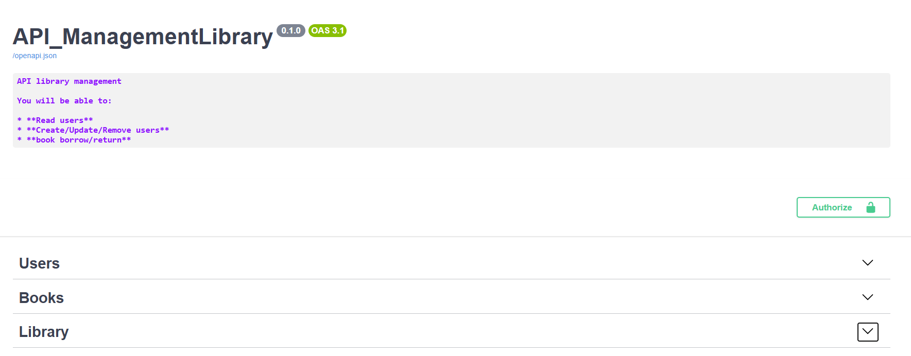

# API для Управления Библиотекой
### Реализация бэкенд сервиса для управление библиотекой 

Используемые технологии:
- Фреймворк: FastAPI
- База данных: PostgreSQL
- ORM: SQLAlchemy
- Аутентификация: JWT
- Управление миграциями: Alembic
- Тестирование: Pytest
- Web-сервер: Nginx

Реализованный функционал:
- авторизация и аутентификация пользователей (библиотекарей)
- управление книгами
- управление читателями
- выдача и возврат книг

## Структура базы данных
База данных состоит из трех таблиц (users, books, receivingbooks). 
Таблицы users и books связаны друг с другом по схеме "многие ко многим". В качестве "промежуточной" или "ассоциативной" таблицы используется таблица receivingbooks, которая содержит вторичные ключи таблиц users и books, а также дополнительную информацию по выдачи книг. Данная структура позволяет получать информацию из базы данных о книгах, полученных конкретным пользователем одним ORM-запросом.

## Бизнес-логика
1. Книгу можно выдать, только если есть доступные экземпляры (количество экземпляров > 0). При выдаче количество экземпляров уменьшается на 1.

Для реализации данной бизнес-логики проводим поиск книги в БД по id и проверяем её свойство count. В случае равенства значения count нулю вызываем исключение, которое потом обрабатываем.

2. Фиксируется факт выдачи книги пользователю. 

Для реализации данной бизнес-логики создаем объект таблицы receivingbooks с данными пользователя и книги, заносим данный объект в БД, и в случае повторения уникальных записей обрабатываем исключение.

3. Один читатель не может взять более 3-х книг одновременно.

Для реализации данной бизнес-логики делаем выборку записей таблицы receivingbooks с указанным id пользователя и return_date со значением равным NULL (книга не возвращена). Если количество записей равно 3, то вызываем исключение и затем обрабатываем его.

## Реализация аутентификации

Для аутентификации в проекте используются токены (JWT), для работы с jwt используется библиотека PyJWT.
Выбор PyJWT обусловлен большим количеством звезд на GitHub и реальной поддержкой проекта, библиотека имеет много релизов и постоянно обновляется.

При авторизации пользователя формируется access token с ограниченным временем действия. Далее token передается на фронтенд в теле ответа и записывается в cookie.

Создание защищённого эндпоинта реализовано с использование зависимостей (через функцию Depends). 
При обращении к защищенному эндпоинту происходит вызов функции (зависимости) current_superuser_user. Данная функция извлекает из cookie access token пользователя, используя для этого инструмент FastAPI APIKeyCookie. Затем проверяет наличие токена и срок его действия. В случае валидности access token из него извлекается id пользователя, по которому ищется пользователь в БД, далее у найденного пользователя проверяется является ли он администратором (флаг is_superuser).
Если условия выполняются, то функция current_superuser_user возвращает объект пользователя user, иначе вызывается исключение и пользователю предлагается авторизироваться.

## Предложения к проекту

Можно реализовать отправку письма на email читателя, при регистрации выдачи книги, с уведомлением о данном действии. Для реализации можно использовать очередь задач Celery, а в качестве брокера сообщений использовать БД Redis. Для этого необходимо создать задачу отправки письма celery.task и вызвать её при регистрации выдачи книги.   


## Правила использования

Пользователи разделяются на: библиотекарь и читатель.

Библиотекарь может управлять всеми ресурсами, выдавать/получать книги.

## Запуск проекта

Для развертывания проекта используется `Docker Compose`.

Перед запуском проекта необходимо подготовить env-файл (env файл хранится в репозитории потому, что проект тестовый):

Чтобы запустить проект используем команду:
```
docker compose up -d
```

При первом запуске проекта необходимо выполнить миграции базы данных с помощью Alembic 

```
docker compose exec app alembic upgrade head
```

#### Последнии миграции вносят изменения в таблицу с книгами (books): 
- добавлено новое необязательное поле description 
- поля description со значением NULL получают новое значение - "Новое поступление"

Стартовая страница проекта [http://127.0.0.1:80](http://127.0.0.1:80).


Страница с интерактивной документацией [http://127.0.0.1:80/docs](http://127.0.0.1:80/docs).


При миграции базы данных заполняется таблица с книгами и таблица пользователей, в которую добавляются два пользователя с правами администратора (библиотекаря).

Первый пользователь с email: admin1@lib.ru и паролем 1qaz!QAZ, второй пользователь с email: admin2@lib.ru и паролем 2wsx@WSX.

Для работы с данными необходимо авторизоваться через запрос /api/users/login в разделе Users



Затем можно начать работу по управлению библиотекой. 

Для каждой задачи создан отдельный раздел:
- User - авторизация и аутентификация библиотекарей, создание и редактирование читателей
- Books - управление книгами, получение списка всех книг с указанием наличия (только для библиотекарей, т.к. информация служебная)
- Library - выдача и возврат книг, получение списка не возвращенных книг читателя



## Тестирование проекта
Перед началом тестирования необходимо выполнить команду 
```
pip install openai==1.55.3 httpx==0.27.2 --force-reinstall

```
для обновления библиотек, используемых для асинхронного тестирования FastAPI

Для тестирования проекта необходимо создать тестовую базу данных командой
```
docker compose -f docker-compose-test.yml up -d
```

Перейти в каталог с тестами
```
cd tests
```

Для тестирования раздела работы с пользователями
```
pytest -v test_user.py
```
В данном разделе протестирована авторизация пользователя (библиотекаря) и CRUD'ы пользователей.

Для тестирования разделов работы с книгами и библиотеки (выдача книг)
```
pytest -v test_book_library.py
```
В данном разделе реализована проверка бизнес-логи: попытка взять 4-ю книгу, попытка взять книгу, которой нет в наличии, а также попытка создания карточки книги без авторизации библиотекаря.


## Licence

Author: Stanislav Rubtsov